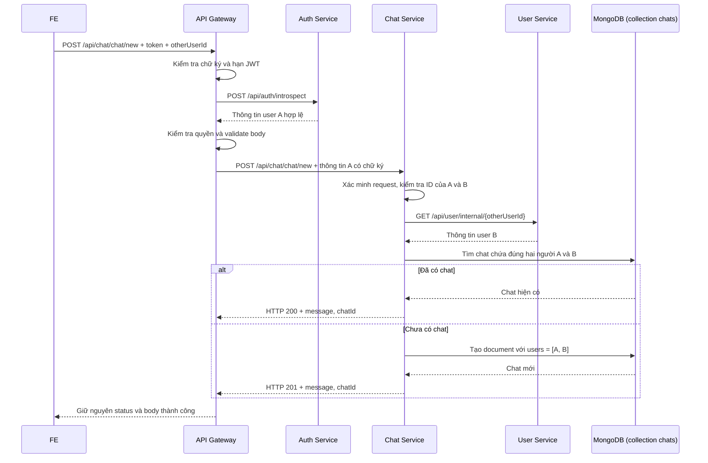

# Luồng hoạt động tổng quan của chức năng chat

Tài liệu mô tả cách FE sử dụng các API hiện tại để chọn người nhắn tin, mở cuộc trò chuyện và gửi, nhận tin nhắn.

Giả sử **A là người đang đăng nhập**, **B là người A muốn nhắn tin**. Các đường dẫn FE bên dưới đều gọi qua API Gateway. Request HTTP cần header `Authorization: Bearer <access_token>`.

## 1. Phân biệt các ID

| Trường | Ý nghĩa | Lấy từ đâu? |
| --- | --- | --- |
| User ID của A | Người đang thực hiện request | Backend lấy từ thông tin xác thực, qua `request.user._id` |
| `otherUserId` | User ID của B | FE lấy `_id` của người được chọn trong danh sách người dùng hoặc dữ liệu trang cá nhân |
| `chatId` | ID của cuộc trò chuyện giữa A và B | API tạo/mở chat hoặc API danh sách chat trả về |

`otherUserId` và `chatId` là hai ID khác nhau. FE không tự tạo `otherUserId`; phải dùng ID của người dùng thực sự tồn tại.

## 2. Luồng từ danh sách người dùng đến mở chat

### Bước 1: FE lấy danh sách người dùng

```http
GET /api/user/user/all
Authorization: Bearer <access_token_cua_A>
```

Gateway chuyển request đến User Service. Với tài khoản thông thường, response có dạng:

```json
{
  "users": [
    {
      "_id": "64b123456789abcdef123456",
      "username": "Nguyễn Văn B"
    }
  ]
}
```

ID trong ví dụ chỉ để minh họa. Tài khoản admin còn được trả thêm `email` và `role` trong danh sách.

FE hiển thị tên người dùng và giữ `_id` đi kèm từng người. API hiện trả cả người đang đăng nhập, nên FE cần lọc A ra khỏi danh sách chọn người nhắn tin.

### Bước 2: A chọn B

Khi A bấm “Nhắn tin” với B, FE lấy `_id` của B làm `otherUserId`:

```ts
const otherUserId = selectedUser._id;
```

Nếu FE đã có ID của B từ trang cá nhân thì có thể dùng ngay, không cần gọi lại danh sách người dùng.

### Bước 3: FE gọi API tạo hoặc mở cuộc trò chuyện

```http
POST /api/chat/chat/new
Authorization: Bearer <access_token_cua_A>
Content-Type: application/json

{
  "otherUserId": "64b123456789abcdef123456"
}
```

FE chỉ gửi ID của B. Backend xác định A từ token.

Mặc dù route có tên `chat/new`, API này kiểm tra cuộc trò chuyện hiện có trước khi tạo mới.

### Bước 4: FE nhận `chatId` và mở màn hình chat

Nếu chưa có cuộc trò chuyện, API tạo mới và trả HTTP **201**:

```json
{
  "message": "Tạo cuộc trò chuyện mới thành công",
  "chatId": "<id_cuoc_tro_chuyen_moi>"
}
```

Nếu đã có cuộc trò chuyện giữa A và B, API trả HTTP **200**:

```json
{
  "message": "Cuộc trò chuyện đã tồn tại",
  "chatId": "<id_cuoc_tro_chuyen_da_co>"
}
```

Cả hai trường hợp, FE dùng `chatId` để mở cuộc trò chuyện. Các chuỗi `<...>` trong ví dụ là chỗ điền giá trị thực tế.

## 3. Backend xử lý `chat/new` như thế nào?



### Tại API Gateway

1. `JwtAuthGuard` kiểm tra JWT và gọi Auth Service qua `/api/auth/introspect`. Kết quả xác thực cung cấp `req.user`.
2. `RolesGuard` cho phép người đã xác thực truy cập vì route này không khai báo role riêng.
3. Validation kiểm tra `otherUserId` không rỗng và đúng định dạng MongoDB ObjectId.
4. `ChatController.createChat()` gọi `ChatService.createChat(body, req.user)`.
5. Service gửi HTTP POST đến `${CHAT_SERVICE_URL}/api/chat/chat/new`. URL mặc định của Chat Service là `http://localhost:5002`.

Gateway gửi body cùng các header `x-request-id`, `x-user-payload`, `x-user-timestamp`, `x-user-signature`. Thông tin A được encode Base64 và ký bằng `CHAT_INTERNAL_SECRET`; Chat Service dùng chữ ký để xác minh request. Base64 chỉ là mã hóa biểu diễn dữ liệu, chữ ký mới phục vụ kiểm tra tính xác thực.

### Tại Chat Service

1. `ChatAuthGuard` xác minh chữ ký và thời gian của request, kiểm tra chữ ký đã dùng, sau đó đọc thông tin A vào `request.user`.
2. `ChatController.createChat()` truyền DTO, user và request ID vào `ChatService.createChat()`.
3. Service kiểm tra `otherUserId`, từ chối chat với chính mình và kiểm tra định dạng ID của cả hai người.
4. `UserClientService.getUser()` gọi User Service để xác nhận B tồn tại. Bước này chạy trước bước tìm chat cũ.
5. Service tìm cuộc trò chuyện có đúng hai người:

   ```ts
   findOne({
     users: { $all: [userId, otherUserId], $size: 2 },
   });
   ```

6. Nếu đã có, trả `chatId` hiện tại. Nếu chưa có, tạo document `{ users: [userId, otherUserId] }` trong collection `chats`. Schema tự thêm `createdAt` và `updatedAt`.
7. Controller trả HTTP 200 hoặc 201; Gateway chuyển kết quả thành công về FE.

## 4. Sau khi mở cuộc trò chuyện

| Hành động của FE | API | Hành vi chính của backend |
| --- | --- | --- |
| Xem danh sách chat của A | `GET /api/chat/chat/all` | Trả `{ chats }`, gồm thông tin người còn lại, tin mới nhất và số tin chưa đọc; sắp xếp theo `updatedAt` giảm dần |
| Xem lịch sử chat | `GET /api/chat/message/:chatId` | Kiểm tra A thuộc chat, đánh dấu tin của người kia là đã xem, trả `{ messages, user }` theo thứ tự thời gian tăng dần |
| Gửi tin nhắn | `POST /api/chat/message` | Kiểm tra người gửi thuộc chat, lưu tin nhắn, cập nhật tin mới nhất và phát `newMessage` cho người nhận đang kết nối |

Nếu A chọn một cuộc trò chuyện từ danh sách chat đã có, FE dùng `chat._id` của mục đó để lấy lịch sử, không cần gọi `chat/new` lại.

Ví dụ gửi tin nhắn văn bản, không có ảnh:

```http
POST /api/chat/message
Authorization: Bearer <access_token_cua_A>
Content-Type: application/json

{
  "chatId": "<chatId_nhan_tu_API>",
  "text": "Chào bạn!"
}
```

Nếu gửi ảnh, dùng `multipart/form-data` với `chatId`, file `image` và `text` nếu có. Giới hạn file ảnh là 5 MB.

## 5. Socket.IO tham gia ở đâu?

`chat/new` chỉ tìm hoặc tạo cuộc trò chuyện và trả `chatId`. Hàm này chưa tạo tin nhắn và không phát sự kiện realtime thông báo chat mới.

FE kết nối Socket.IO qua Gateway, path mặc định `/socket.io`, truyền access token trong `auth.token`. Gateway proxy kết nối đến Chat Service; `chat.gateway.ts` xác minh token và theo dõi các socket của từng user.

| Sự kiện | Chiều truyền | Mục đích |
| --- | --- | --- |
| `getOnlineUsers` | Backend → FE | Cập nhật danh sách ID người đang kết nối |
| `newMessage` | Backend → FE người nhận | Gửi `{ message }` khi có tin nhắn mới |
| `messagesSeen` | Backend → FE người gửi | Gửi `{ chatId, seenBy }` khi tin nhắn được đánh dấu đã xem |
| `typing` / `typingStop` | FE → Backend | Báo đang gõ hoặc ngừng gõ, với payload `{ chatId, targetUserId }` |
| `userTyping` / `userTypingStop` | Backend → FE người nhận | Hiển thị hoặc tắt trạng thái đang gõ |

Khi A gửi tin qua HTTP, backend lưu tin vào MongoDB rồi gọi `chatGateway.emitNewMessage()` cho B. Nếu B chưa kết nối socket, tin vẫn được lưu và B có thể lấy qua API lịch sử. Khi lấy lịch sử, backend cũng phát `messagesSeen` cho người gửi nếu có tin mới được đánh dấu đã xem.

## 6. Các trường hợp FE cần xử lý khi mở chat

| HTTP status | Trường hợp |
| --- | --- |
| `200` | Đã có cuộc trò chuyện, dùng `chatId` được trả về |
| `201` | Tạo cuộc trò chuyện thành công, dùng `chatId` được trả về |
| `400` | Thiếu hoặc sai định dạng ID, hoặc chọn chính mình |
| `401` | Xác thực thất bại; trong luồng nội bộ cũng có thể do chữ ký request không hợp lệ |
| `404` | Không tìm thấy người B để tạo cuộc trò chuyện |
| `502` / `503` | Lỗi gọi service phụ thuộc hoặc cấu hình service chưa sẵn sàng |

## 7. Các file source liên quan

- [Gateway UserController](../../gateway/src/modules/user/user.controller.ts): API danh sách người dùng cho FE.
- [UserService](../../user/src/modules/user/user.service.ts): truy vấn danh sách và thông tin người dùng.
- [Gateway JWT strategy](../../gateway/src/modules/auth/common/guard/jwt/jwt.strategy.ts): xác thực qua Auth Service.
- [Gateway ChatController](../../gateway/src/modules/chat/chat.controller.ts): nhận các API chat từ FE.
- [Gateway ChatService](../../gateway/src/modules/chat/chat.service.ts): chuyển request sang Chat Service.
- [ChatAuthGuard](../src/common/guards/chat-auth.guard.ts): xác thực request tại Chat Service.
- [ChatController](../src/modules/chat/chat.controller.ts): gọi các hàm nghiệp vụ chat.
- [ChatService](../src/modules/chat/chat.service.ts): tạo chat, lấy lịch sử và gửi tin nhắn.
- [UserClientService](../src/modules/chat/user-client.service.ts): Chat gọi User Service.
- [ChatGateway](../src/modules/chat/chat.gateway.ts): xử lý Socket.IO.
- [Chat schema](../src/schemas/chat.schema.ts): cấu trúc document trong collection `chats`.
